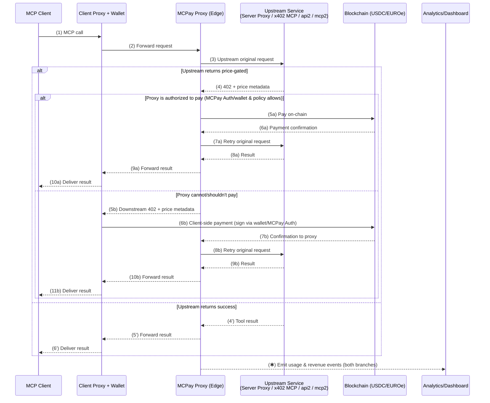

# [MCPay](https://mcpay.tech)


<div align="center">
    
  [](https://twitter.com/mcpaytech)
  [](https://github.com/microchipgnu/mcpay) 
  [](https://opensource.org/licenses/Apache-2.0)

</div>


<div align="center">

[Website](https://mcpay.tech) &nbsp;&nbsp;|&nbsp;&nbsp;
[Browse Registry](https://mcpay.tech/servers) &nbsp;&nbsp;|&nbsp;&nbsp;
[Register/Monetize](https://mcpay.tech/register)

</div>

---

## What is MCPay?

MCPay is open-source infrastructure that adds **on-chain payments** to any [Model Context Protocol (MCP)](https://modelcontextprotocol.io) server using the [x402 "Payment Required" protocol](https://x402.org).

It enables MCP clients — such as ChatGPT, Cursor, and others — to make **pay-per-call requests** instead of relying on static subscriptions or API keys.

The goal is to let AI agents and applications pay only for what they use, automatically and transparently.

---

## Why MCPay (in 30 seconds)

* **Clients** → Pay only for what they use — no subscriptions, no keys, no setup. Works out of the box with MCP-compatible apps (ChatGPT, Cursor, and more).
* **Developers** → Monetize and get discovered instantly using our SDK (or a compatible one), monetization wrapper, or public index. Set per-call, per-token, or dynamic pricing and receive payments automatically.
* **Agents** → Perform real **agent↔service micropayments**, enabling autonomous access to APIs, inference, data, and more.

---

## How it works

MCPay handles the entire payment lifecycle transparently for both developers and clients:

- Follows x402 protocol with structured price metadata.
- Accepts and verifies the on-chain payment, then automatically retries the original MCP request once confirmed.
- Streams usage and revenue events to dashboards and analytics endpoints.

This mechanism ensures that any MCP-compatible app or agent can pay per call — either directly (via wallet) or through a delegated, policy-based proxy.



In practice, this means any MCP server can become a paid endpoint with zero friction.

The MCPay proxy acts as the coordination layer between **clients, wallets, and upstream services** — automatically handling `402` negotiation, on-chain payments, and retries.

Once a payment is confirmed, the same request is retried transparently, and the result is streamed back to the client along with usage and revenue data.

---

## Key components

### 1) Registry

Discover MCP servers and their priced tools at **[mcpay.tech/servers](https://mcpay.tech/servers)**. Searchable, machine‑readable, agent‑friendly.

### 2) Monetizer (Proxy)

Wrap existing HTTP endpoints or MCP servers with the **MCPay proxy** to enforce pay‑per‑call. Zero code changes to your upstream service.

You can monetize via [MCPay Registry](https://mcpay.tech/register) or [programmatically](./packages/js-sdk/README.md).

---

## Quickstart

MCPay lets you add on-chain pricing to any MCP or OpenAPI server.

Whether you prefer to configure everything from the dashboard or define logic in code, both paths use the same x402 standard.

| Path | Best for | What it does |
|---|---|---|
| **[Website](https://mcpay.tech/register)** | Fastest go-live, existing services | Configure prices per tool/route in the dashboard. |
| **[SDK](./packages/js-sdk/README.md)** | Custom logic & full control | Define **paid tools** in code, set pricing, and ship an MCP server that speaks x402 out of the box. |

### Option A — Connect to a paid MCP server (CLI)

Start an MCP stdio proxy to one or more remote MCP servers. Use either an API key or a wallet private key.

```bash
# Using an API key (recommended)
npx mcpay connect --urls https://mcpay.tech/v1/mcp/05599356-7a27-4519-872a-2ebb22467470 --api-key mcpay_YOUR_API_KEY

# Or using an EVM wallet private key (x402 payments)
npx mcpay connect --urls https://mcpay.tech/v1/mcp/05599356-7a27-4519-872a-2ebb22467470 --evm 0xYOUR_PRIVATE_KEY --evm-network base-sepolia

# Or using an SVM wallet secret key (x402 payments)
npx mcpay connect --urls https://mcpay.tech/v1/mcp/05599356-7a27-4519-872a-2ebb22467470 --svm YOUR_SECRET_KEY --svm-network solana-devnet
```

You can pass multiple URLs via a comma‑separated list to `--urls`.

### Option B — Programmatic client (SDK)

```ts
import { Client } from '@modelcontextprotocol/sdk/client/index.js'
import { StreamableHTTPClientTransport } from '@modelcontextprotocol/sdk/client/streamableHttp.js'
import { withX402Client } from 'mcpay/client'
import { createSigner } from 'x402/types'

// Create signer for EVM network
const evmSigner = await createSigner('base-sepolia', process.env.EVM_PRIVATE_KEY!) // dev only; secure in prod
const url = new URL('https://mcpay.tech/v1/mcp/05599356-7a27-4519-872a-2ebb22467470')

// Create transport
const transport = new StreamableHTTPClientTransport(url)

// Initialize MCP client
const client = new Client({ name: 'my-mcp-client', version: '1.0.0' }, { capabilities: {} })
await client.connect(transport)

// Wrap client with X402 payment capabilities
const paymentClient = withX402Client(client, {
  wallet: { evm: evmSigner },
  maxPaymentValue: BigInt(0.1 * 10 ** 6) // limit max on‑chain value (base units, e.g. 6‑decimals for USDC)
})

const tools = await paymentClient.listTools()
console.log('Available tools:', tools)
```

---

## SDK

Install:

```bash
npm i mcpay   # pnpm add mcpay / yarn add mcpay / bun add mcpay
```

Features:

* Automatic `402` handling (x402 pattern).
* Works with plain HTTP **and** MCP servers.
* Pluggable wallet/transport; supports multiple chains/tokens (EVM & SVM).
* Includes a **CLI** for local/prod proxying.
* Support for Base, Avalanche, IoTeX, Sei (EVM) and Solana (SVM) networks.

See **[js-sdk/README.md](./js-sdk/README.md)** for API details.

### Building monetized server (Hono)

```ts
import { Hono } from "hono"
import { createMcpPaidHandler } from "mcpay/handler"
import { z } from "zod"

const app = new Hono()

const handler = createMcpPaidHandler(
    (server) => {
        server.paidTool(
            "weather",
            "Paid tool",
            "$0.001",
            { city: z.string() },
            {},
            async ({ city }) => ({
                content: [{ type: "text", text: `The weather in ${city} is sunny` }],
            })
        )

        server.tool(
            "free_tool",
            "Free to use",
            { s: z.string(), city: z.string() },
            async ({ s, city }) => ({
                content: [{ type: "text", text: `We support ${city}` }],
            })
        )
    },
    {
        facilitator: {
            url: "https://facilitator.mcpay.tech"
        },
        recipient: {
            "evm": {address: "0xc9343113c791cB5108112CFADa453Eef89a2E2A2", isTestnet: true},
            "svm": {address: "4VQeAqyPxR9pELndskj38AprNj1btSgtaCrUci8N4Mdg", isTestnet: true}
        }
    },
    {
        serverInfo: { name: "paid-mcp", version: "1.0.0" },
    },
)

app.use("*", (c) => handler(c.req.raw))

export default app
```

---

## CLI

Start a local stdio proxy to remote MCP servers:

```json
{
  "mcpServers": {
    "Paid Server": {
      "command": "npx",
      "args": [
        "mcpay",
        "connect",
        "--urls",
        "https://mcpay.tech/v1/mcp/05599356-7a27-4519-872a-2ebb22467470",
        "--api-key",
        "mcpay_YOUR_API_KEY"
      ]
    }
  }
}
```

Run `mcpay connect --help` for all flags.

---