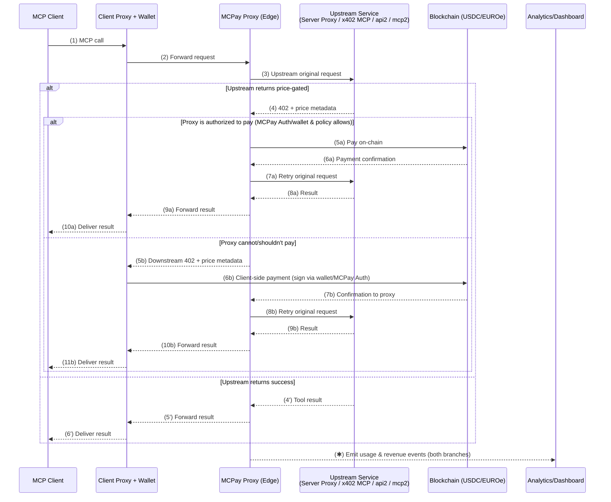

[Website](https://mcpay.tech) · [Discover](https://mcpay.tech/servers) · [Register](https://mcpay.tech/register)

---

## What is MCPay?

MCPay is open-source infrastructure that adds **on-chain payments** to any [Model Context Protocol (MCP)](https://modelcontextprotocol.io) server using the [x402 “Payment Required” protocol](https://x402.org).

It enables MCP clients — such as ChatGPT, Cursor, and others — to make **pay-per-call requests** instead of relying on static subscriptions or API keys.

The goal is to let AI agents and applications pay only for what they use, automatically and transparently.

---

## Why MCPay (in 30 seconds)

* **Clients** → Pay only for what they use — no subscriptions, no keys, no setup. Works out of the box with MCP-compatible apps (ChatGPT, Cursor, and more).
* **Developers** → Monetize and get discovered instantly using our SDK (or a compatible one), monetization wrapper, or public index. Set per-call, per-token, or dynamic pricing and receive payments automatically.
* **Agents** → Perform real **agent↔service micropayments**, enabling autonomous access to APIs, inference, data, and more.

---

## How it works

MCPay handles the entire payment lifecycle transparently for both developers and clients:

- Follows x402 protocol with structured price metadata.
- Accepts and verifies the on-chain payment, then automatically retries the original MCP request once confirmed.
- Streams usage and revenue events to dashboards and analytics endpoints.

This mechanism ensures that any MCP-compatible app or agent can pay per call — either directly (via wallet) or through a delegated, policy-based proxy.

In practice, this means any MCP server can become a paid endpoint with zero friction.

The MCPay proxy acts as the coordination layer between **clients, wallets, and upstream services** — automatically handling `402` negotiation, on-chain payments, and retries.

Once a payment is confirmed, the same request is retried transparently, and the result is streamed back to the client along with usage and revenue data.
